# Proposal Box

  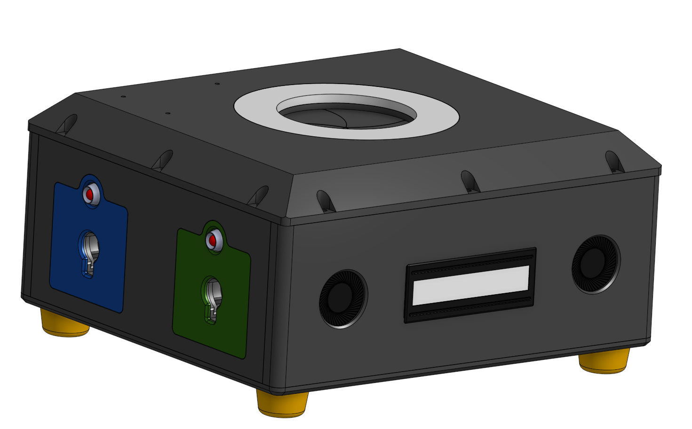
  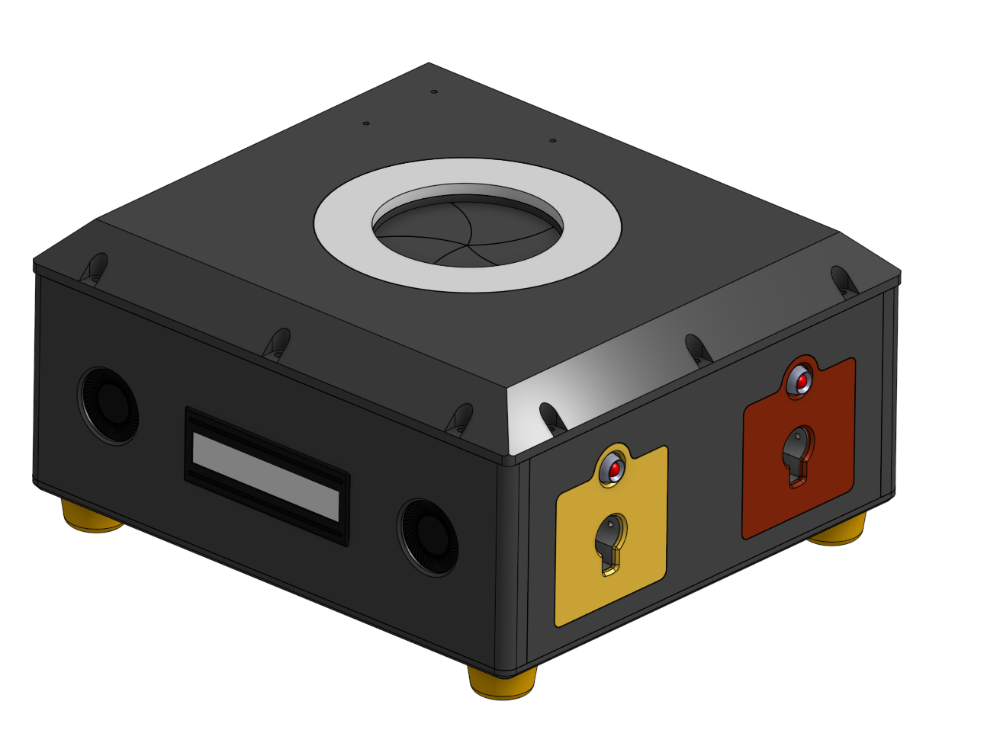 

  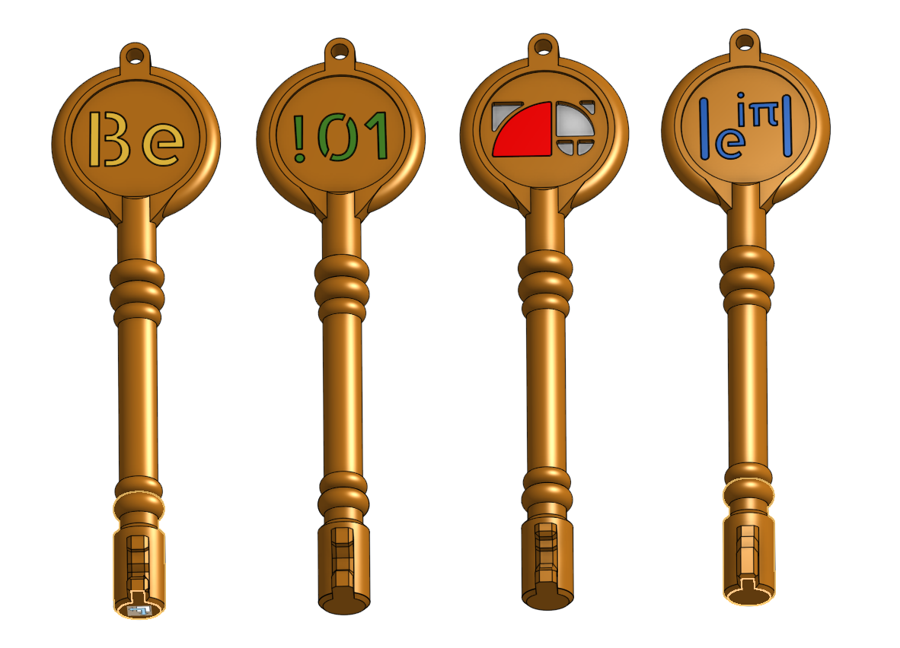

## Electrical Design

The design consists of 3 custom PCBs, alongside a set of electrical and mechanical parts to accomplish the motion, and user interaction desired.

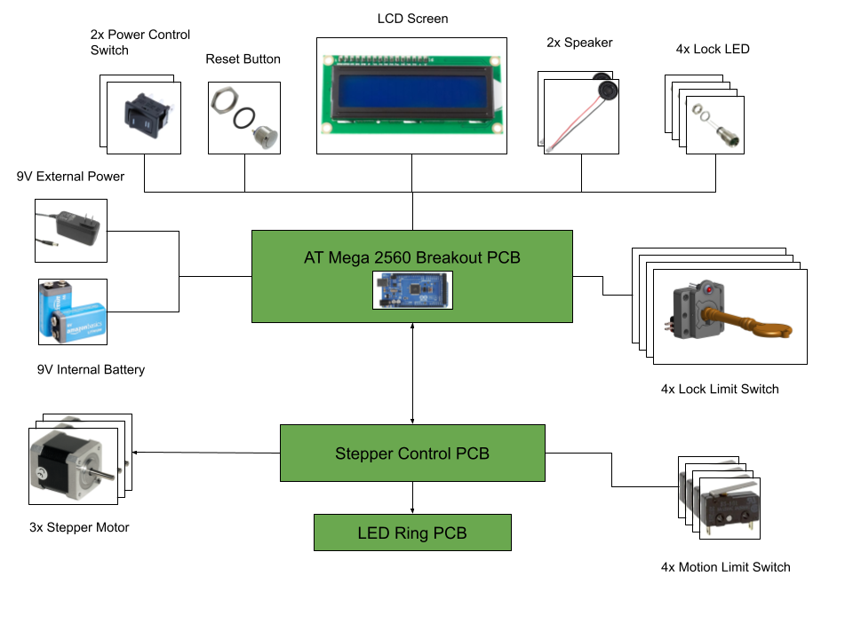

Full schematics, gerber files, and design files can be found in [electrical design folder](electrical_design/)

  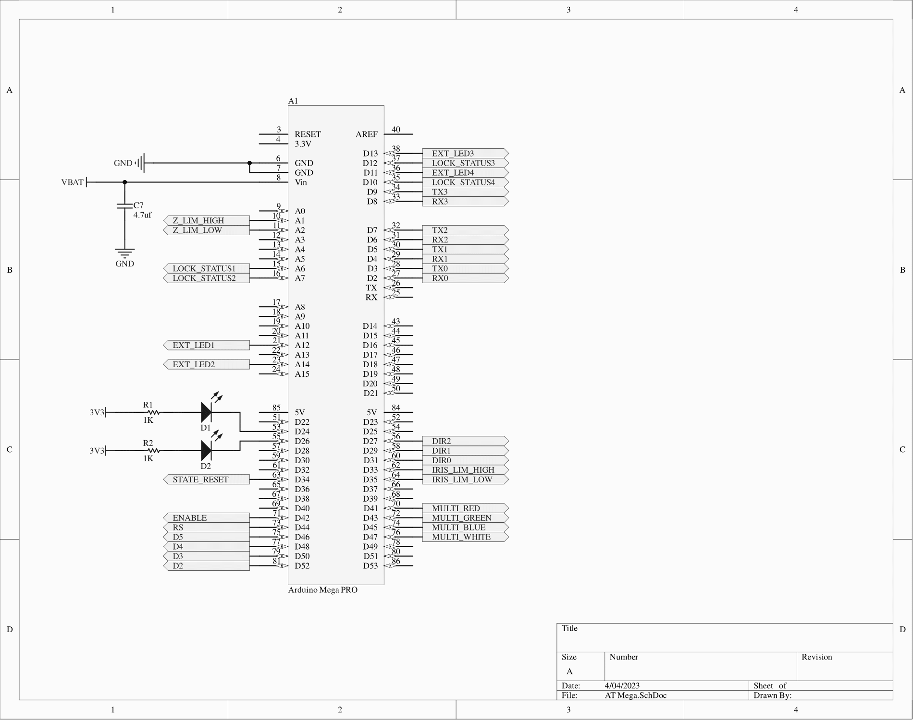
  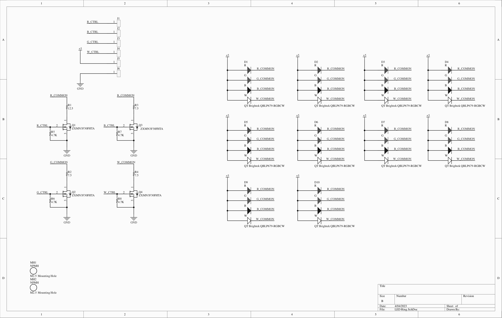 
  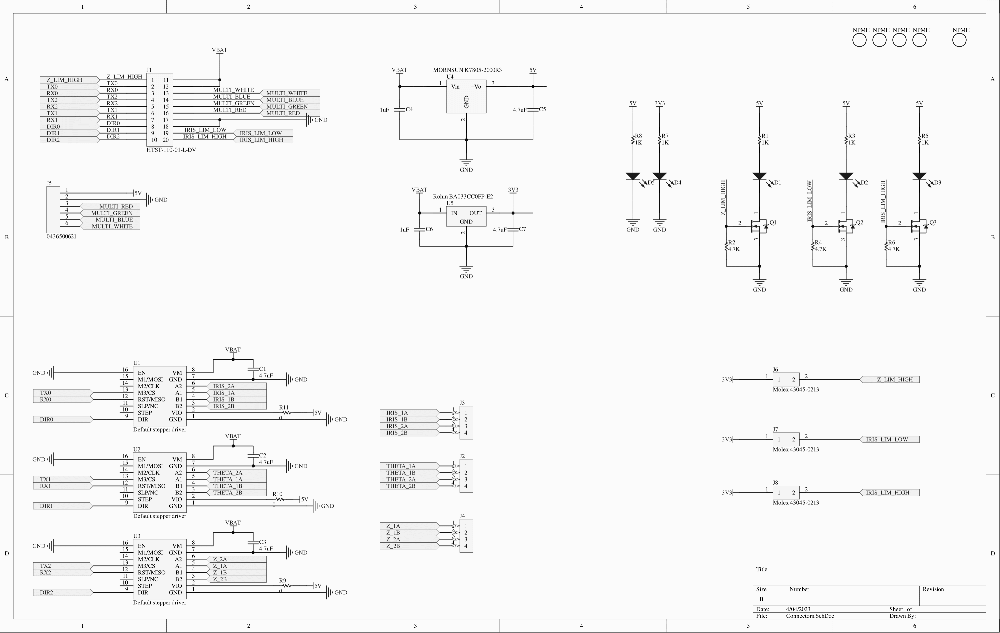 

## Mechanical Design

### Structure

  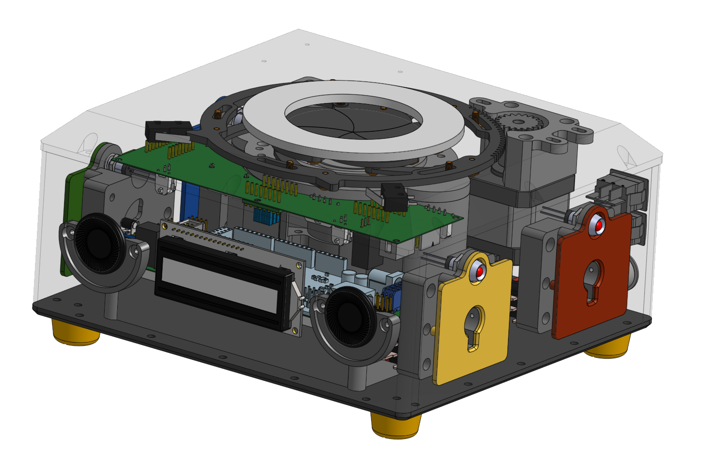
  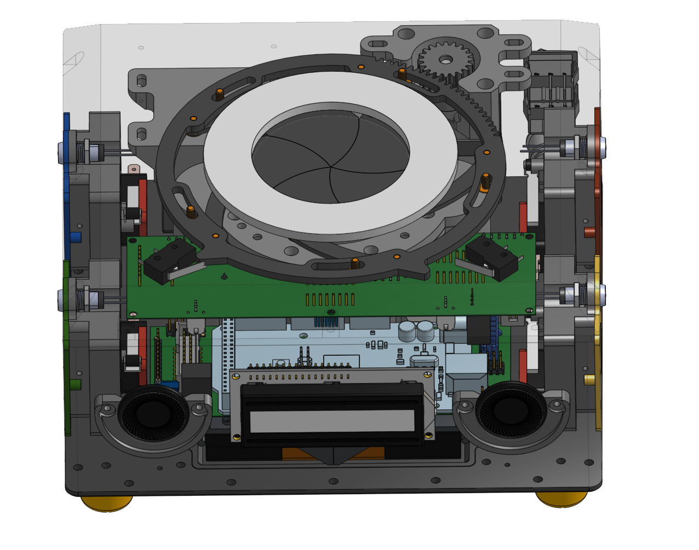 

## Iris

  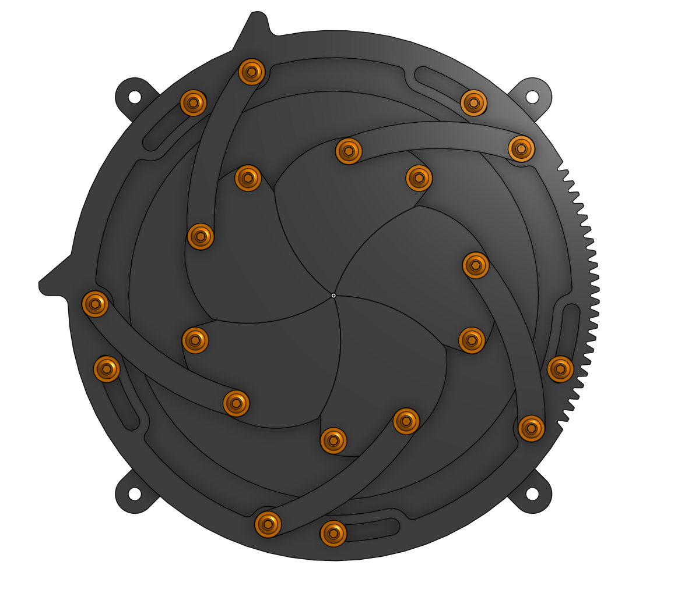
  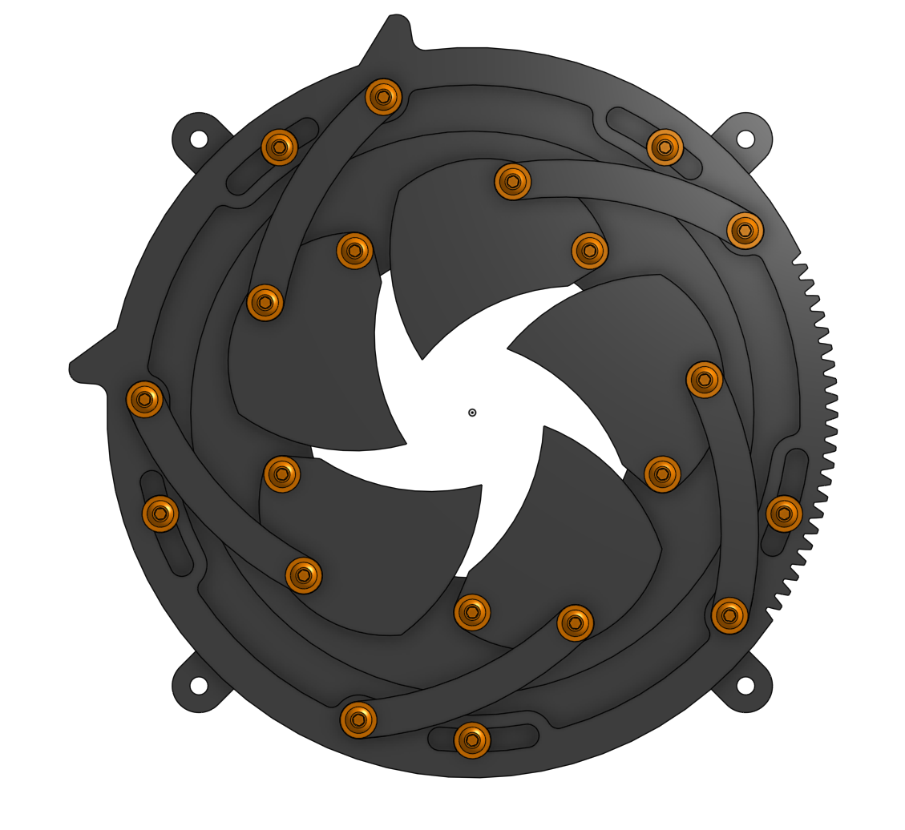 

## Locks

  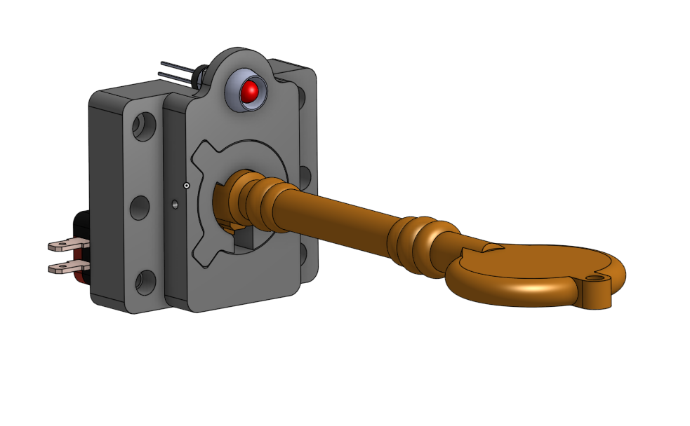
  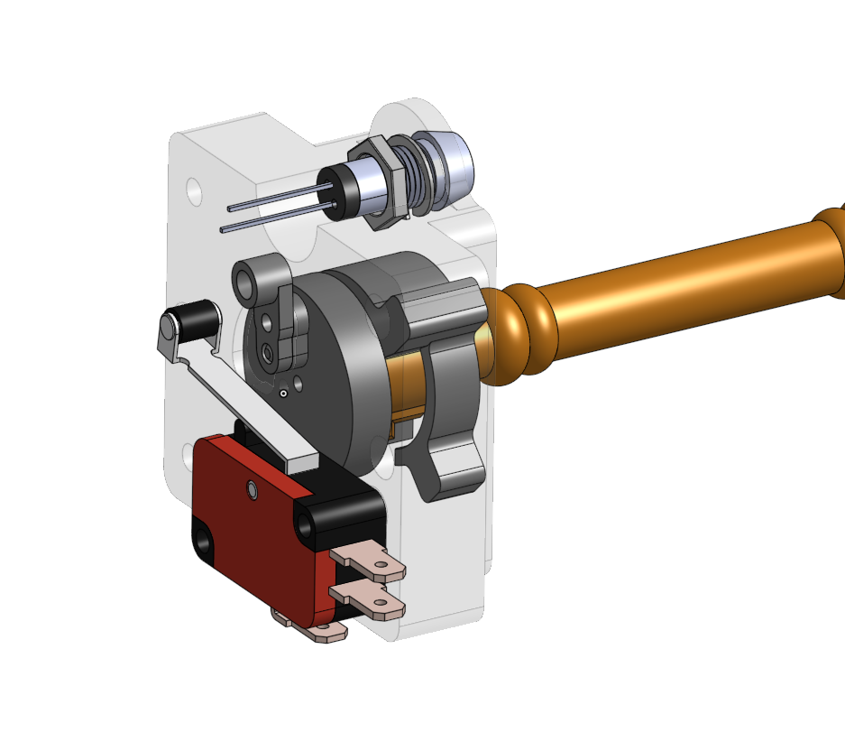 

## BOM

Bill of Materials can be found in the [BOM Folder](BOM/)

## Software